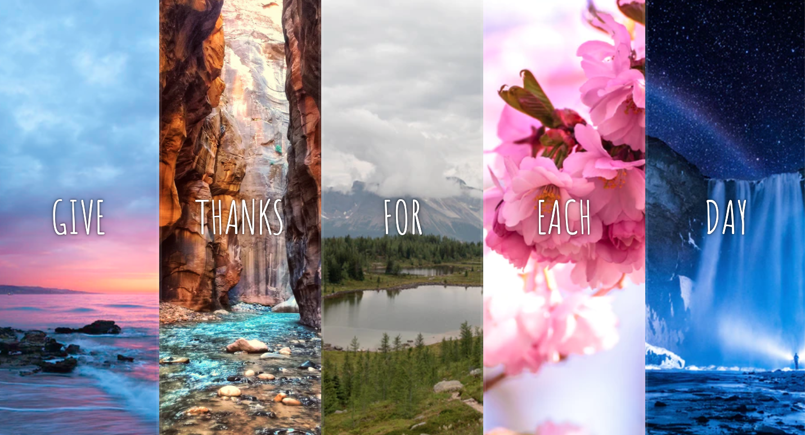
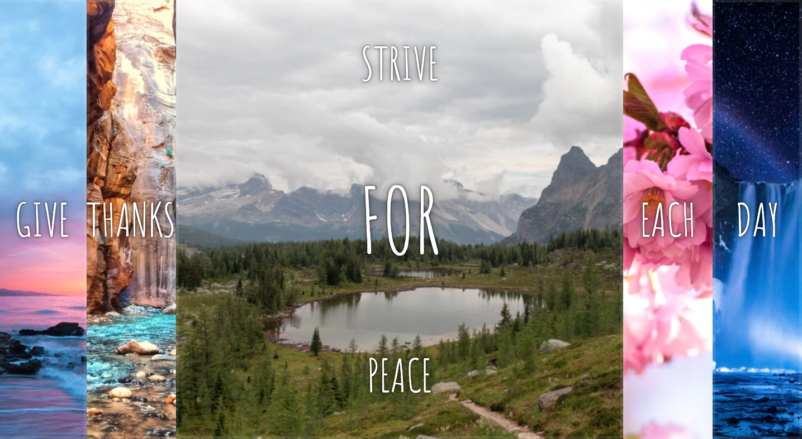

# JavaScript30

Grab the course at [https://JavaScript30.com](https://JavaScript30.com)

Main view:

When a panel is clicked:

SUMMARY:
In this exercise I got to practice my CSS flexbox skills. I enjoyed using transitions plus flex properties to create a cool effect when each panel is clicked on. 